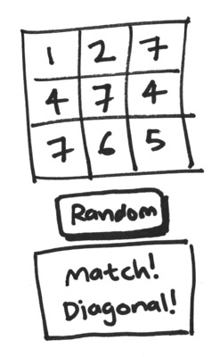

# Playing With Matches :fire:

We'll be making a web page with HTML, CSS, and JavaScript. Let's have a look at how these three pieces fit together.


The structure of every web page looks a bit like this. It's a triangle because the balance should mostly be like that: lots of HTML, quite a lot of CSS, and as little JavaScript as possible.

At the base you have your **HTML**. It's the **structured content** of the page: headings, paragraphs, images, videos.

On top of that you have your **CSS**. This handles the **presentation**: colours, fonts, layout. Note that it's a separate layer: see, there's a line there and everything. It exists apart from the structure and content (the HTML) of the page.

At the very top, in the tiny triangle, is the **JavaScript** (JS). This adds behaviour and interactions to the page. It's the most fragile part of the three. An error in the code (perhaps introduced at midnight by a sleepy developer as a "quick fix") can break the whole block of the JS.

## Set up

You should have a projects folder in your home directory. It's good practice to create all your different projects in one place on your PC so that you can find them easily.

In your projects folder:

* create a folder called **Playing-With-Matches**;
* change into the folder **Playing-With-Matches** from the terminal using `cd Playing-With-Matches`;
* initialize it as a git repository using `git init`.

In GitHub create a new repository called **Playing-With-Matches**:

* click on the + sign left from your profile name;
* select **New repository**;
* enter the repository name **RedAndGreen**;
* now click **Create repository**

You will be presented with a few different setup options, you need to follow the instructions under:

> ...or push an existing repository from the command line

the parameters will be specific to your environment and you can copy and paste them into your terminal.

The command would look like this, with your own git username:

```
git remote add origin git@github.com:<username>/Playing-With-Matches.git
```

As you do each task create the files in the **Playing-With-Matches** folder.

After each task remember to commit your changes using git.

## The Steps

We're going to build up a page that shows a series of random numbers, checks for matches, and shows a message. The end result will look like this:



Work your way through these steps.

1. [Show a number](./show-a-number.md).
* [Show a random number on page load](./show-a-random-number-on-page-load.md).
* [Show three different random numbers on page load](./show-three-different-random-numbers-on-page-load.md).
* [Show a message when two or more random numbers match](show-a-message-when-two-or-more-random-numbers-match.md).
* [Publish your code to the web](./publish-your-code-to-the-web.md).
* [Add a button that shows a new set of random numbers](add-a-button-that-shows-a-new-set-of-random-numbers.md).
* [Add more rows and update the message](add-more-rows-and-update-the-message.md).
* [Republish your work to the web](./republish-your-work-to-the-web.md).
* [Show a message when two or more numbers on the same row or column match](show-a-message-when-two-or-more-numbers-on-the-same-row-or-column-match.md).
* [Show a message when two or more numbers on the same row, column, or diagonal match](show-a-message-when-two-or-more-numbers-on-the-same-row-column-or-diagonal-match.md).
