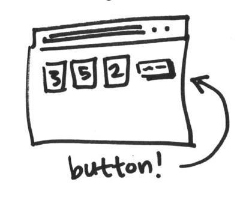

# Add a button that shows a new set of random numbers

> Use JavaScript to update the HTML and show random numbers.

So far, we've been reloading the page to get a new set of random numbers in our boxes. Now we're going to randomise our numbers using a button.

* Add a `button` to your `index.html` and add some styles to make it look more interesting.
* Add some JavaScript that updates the random numbers in all the blocks when you click the button.

To handle clicks on buttons use [addEventListener](https://developer.mozilla.org/en-US/docs/Web/API/EventTarget/addEventListener).
