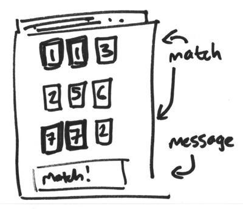

# Add more rows and update the message

> Add more rows of HTML and update JavaScript to check multiple rows.

* Add another two rows of numbers in your HTML. Each number must be randomly generated, like your first row.
* Update your JavaScript to check each row for matches.
* Display a message if there are matches in any row. The message should include the row number of the match, and the number that matched.
