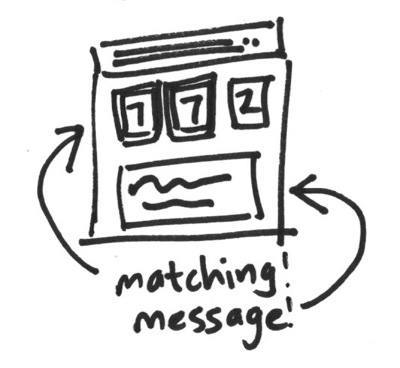

# Show a message when two or more random numbers match

> In this task, you'll use HTML, CSS, and JavaScript to show a message when some of the random numbers match.



Now that your page has three different random numbers, sometimes they'll match. Write some JavaScript that checks if any of numbers match.

## Highlighting

Highlight the numbers that are the matching ones by

* using JS to add a class (for example, `highlight`) to the `div` in the HTML;
* adding styles in your CSS file that use your new class (try changing the `color`, `background-color`, `border`, and more!).

For adding and removing classes, have a look at:

  * [className](https://developer.mozilla.org/en-US/docs/Web/API/Element/className)
  * [classList](https://developer.mozilla.org/en-US/docs/Web/API/Element/classList)

## Messaging

Display a message under the numbers that says

* what the matched number was;
* how many matches there were.

## Add files and push them to GitHub

Once you're done, add your changes to git by using similar commands to the ones you used for the previous tasks. If you want to add multiple files at the same time, you can do it like this:

```
git add index.html styles.css script.js
```
