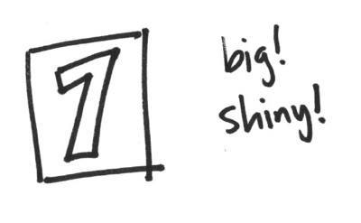

# Show a number

> Create a web page and apply CSS using an embedded style block.



Our first step is to make a web page with a number on it. Create a file called `index.html` that looks something like this:

```html
<!DOCTYPE html>
<html>
<head>
	<title>The title of my page</title>

	<style type="text/css">
	/* CSS goes here */
	</style>
</head>
<body>
	<!-- HTML goes here -->
</body>
</html>
```

Now you'll write some HTML inside the `body` tag and some CSS in the `style` tag of the HTML file.

Add a `div` with a number of your choice inside. Add some styles to make it big and colourful. Try using `font` rules, `color`, `background-color`, and more.

## Use git to add your files

Run `git status` to see what has changed. You should see something like:

```
On branch master
Untracked files:
  (use "git add <file>..." to include in what will be committed)

	index.html

nothing added to commit but untracked files present (use "git add" to track)
```

Now run `git add index.html` to track that file. That tells git to watch it for changes.

If there are files that you don't want git to track, don't add them using `git add`. For example: you might see `index.html~`. That's a local backup file created by your computer, so you don't need to `git add` it.

To commit your changes to git, run `git commit -m "my message"`. The message should be something to remind you of the changes you've just made. You might write `git commit -m "Added my first number"`.

## Push it to GitHub

To send your code to GitHub, run `git push -u origin master`. You'll only need the `-u` the first time you push: it means set (and remember) that the master branch on my machine and the master branch on Github are linked. After that, you can use `git push origin master` or just `git push`.
