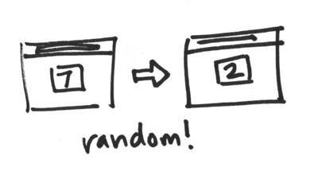

# Show a random number on page load

> In this task you'll use JavaScript to generate a random number and update some HTML.



## The DOM

DOM stands for Document Object Model. This is an in memory representation of the elements contained in an HTML document. Eloquent JavaScript provides a good introduction to the DOM in [Chapter 13: The Document Object Model](http://eloquentjavascript.net/13_dom.html).

You can find elements in the DOM by their `id` or by their `class`. There are a couple ways of doing this. Have a read about these on the [Mozilla Developer Network](https://developer.mozilla.org/en-US/) about:

* [getElementById](https://developer.mozilla.org/en-US/docs/Web/API/Document/getElementById)
* [getElementsByClassName](https://developer.mozilla.org/en-US/docs/Web/API/Document/getElementsByClassName)
* [querySelector](https://developer.mozilla.org/en-US/docs/Web/API/Document/querySelector)

## Make the number random on page load

Update your `index.html` by moving your CSS to an external file, like this:

```html
   <!-- Your CSS goes in the styles.css file -->
	<link rel="stylesheet" href="styles.css">
</head>
```

Add a space for your JavaScript at the bottom of the page, like this:

```html
  <script type="text/javascript">
		// JavaScript code goes here at the bottom
	</script>
</body>
```

Now write some JavaScript that:

* finds your `div` with the number in;
* replaces it with a new random number between 1 and 9.

Every time the page loads, you should see a new random number. Yay!

## Add your files to your repository

Once you are done, add your changes to git by using these commands:

* `git status` to see what changed.
* `git add index.html` to add the changes you made in `index.html` to git.
* `git add styles.css` to add the `styles.css` file to git.
* `git commit -m "your message"` to commit your changes.
* `git push origin master` to push your changes to GitHub.
